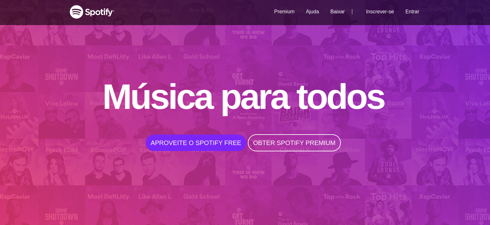
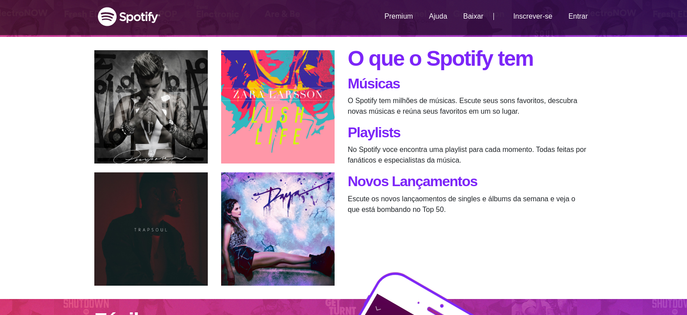
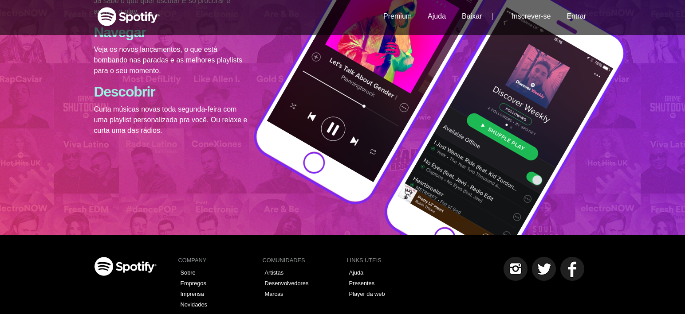

# Clone-Spotify

Projeto elaborado em:
HTML5
CSS
Bootstrap

-  Site Responsivo a diversos dispositivos
-  Menu com trasparencia
-  multiplas camadas de Background
-  alteração de configuração padrão de Bootstrap

Responsivo Mobile

